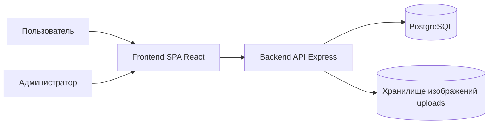
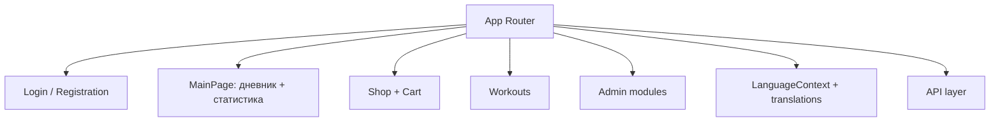
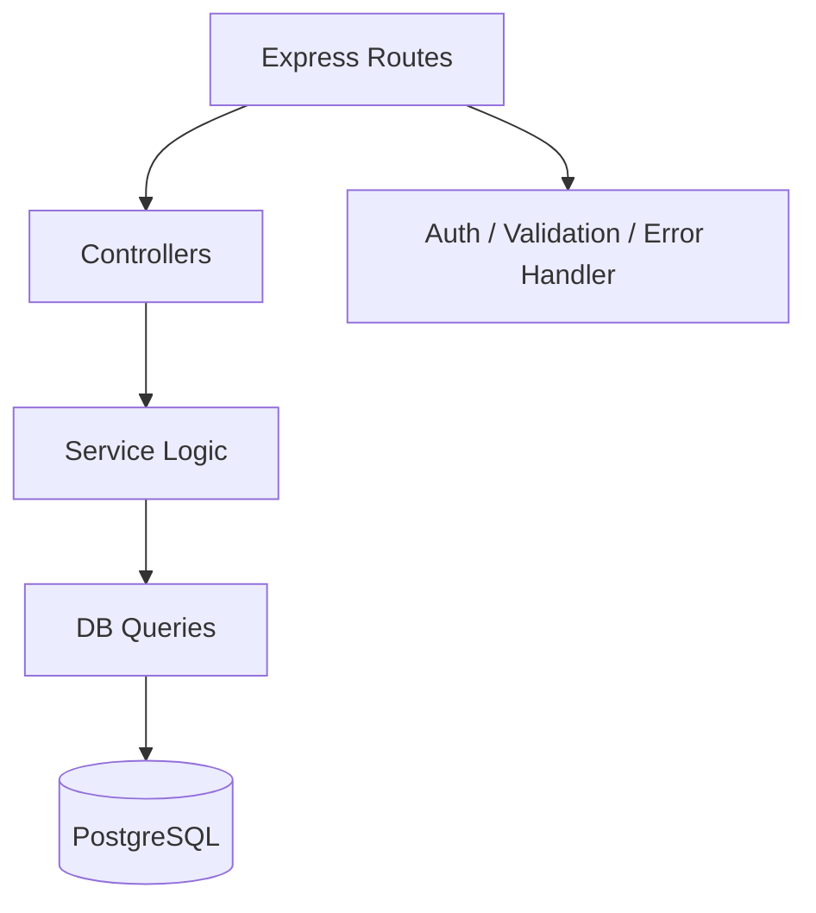
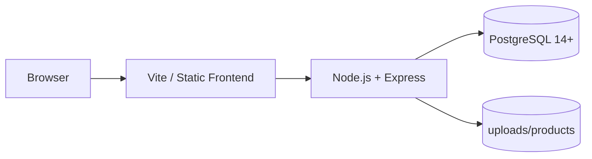
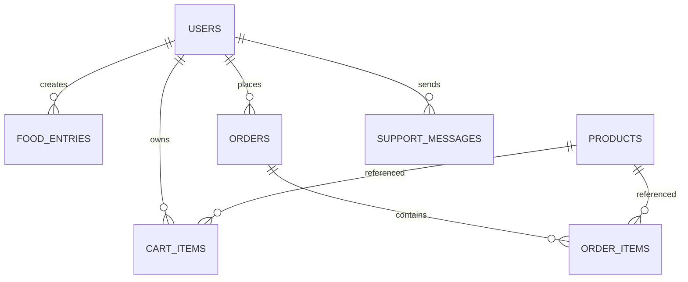
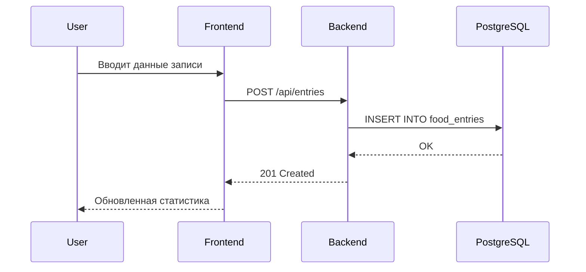

# Дипломный доклад по проекту **Calorie Tracker Pro**

Автор: студент выпускного курса  
Проект: Fullstack веб-приложение для учета питания, тренировок и e-commerce-сценариев  
Технологический стек: React 19 + Vite, Node.js + Express, PostgreSQL, Docker

---

## Аннотация

`Calorie Tracker Pro` — это многофункциональная веб-система для персонального учета питания и калорий, планирования тренировок и покупки продуктов для здорового образа жизни. Проект объединяет:
- пользовательский личный кабинет;
- модуль статистики и аналитики;
- модуль тренировок;
- модуль интернет-магазина;
- административный контур управления данными.

Решение реализовано по клиент-серверной архитектуре, использует ролевую модель доступа (user/admin), поддерживает мультиязычный интерфейс (RU/KZ/EN), и может быть развёрнуто как локально, так и через Docker.

---

## Содержание

1. Введение  
2. Цели и задачи проекта  
3. Анализ предметной области  
4. Функциональные требования  
5. Нефункциональные требования  
6. Архитектура системы  
7. Технологический стек и обоснование  
8. Проектирование базы данных  
9. API и интеграционные сценарии  
10. Реализация frontend  
11. Реализация backend  
12. Безопасность и контроль доступа  
13. Мультиязычность  
14. Тестирование и валидация  
15. Анализ эффективности  
16. Экономическое обоснование  
17. Перспективы развития  
18. Заключение  
19. Приложения (таблицы, диаграммы, чек-листы)

---

## 1. Введение

Актуальность темы определяется ростом цифровых сервисов для контроля здоровья, питания и физической активности. Большинство существующих решений фрагментированы: одни ориентированы только на дневник калорий, другие — только на фитнес, третьи — на покупки. В рамках дипломной работы разработана интегрированная система, закрывающая полный пользовательский цикл.

Практическая ценность работы:
- формирование навыков проектирования полного продукта от БД до UX;
- применение современных технологий веб-разработки;
- реализация ролевой модели и безопасной аутентификации;
- подготовка проекта к демонстрации и реальной эксплуатации.

---

## 2. Цели и задачи проекта

### 2.1 Цель

Разработать полнофункциональную веб-платформу для учета питания и тренировок с элементами интернет-магазина и административной панелью управления.

### 2.2 Задачи

| № | Задача | Результат |
|---|---|---|
| 1 | Спроектировать архитектуру клиент-серверного приложения | Выделены слои frontend/backend/database |
| 2 | Реализовать аутентификацию и роли | JWT + разделение user/admin |
| 3 | Создать модуль учета питания | CRUD записей + статистика |
| 4 | Реализовать модуль тренировок | Каталог, фильтры, карточки, детали |
| 5 | Реализовать модуль магазина | Каталог, корзина, оформление заказа |
| 6 | Реализовать админ-модуль | Управление товарами, пользователями, заказами, тренировками |
| 7 | Добавить мультиязычность | RU/KZ/EN для UI и динамического контента |
| 8 | Обеспечить разворачиваемость | Локально и через Docker |

---

## 3. Анализ предметной области

Целевая аудитория:
- пользователи, контролирующие питание;
- люди, занимающиеся спортом;
- пользователи, которым нужен единый сервис "дневник + магазин + тренировки";
- администраторы контента (товары, тренировки, обращения, пользователи).

Основные боли пользователей:
- отсутствие единой точки контроля питания и активности;
- неудобный ввод и анализ дневных записей;
- отсутствие персональных рекомендаций;
- разрыв между планированием и покупкой продуктов.

Проект решает эти проблемы через интегрированный сценарий:
`план -> учет -> анализ -> действие`.

---

## 4. Функциональные требования

### 4.1 Пользовательский контур

1. Регистрация и вход.
2. Просмотр и редактирование профиля.
3. Добавление записей питания (продукт, калории, БЖУ, дата).
4. Просмотр статистики и графиков.
5. Использование калькулятора нормы калорий и БЖУ.
6. Просмотр каталога товаров.
7. Работа с корзиной, оформление заказа.
8. Просмотр тренировок по категориям и деталям.
9. Смена языка интерфейса.

### 4.2 Административный контур

1. Просмотр пользователей.
2. Управление товарами (CRUD, изображения, сортировка, категории).
3. Просмотр и обработка заказов.
4. Управление тренировками (CRUD, изображения, категории, упражнения).
5. Работа с сообщениями поддержки.

---

## 5. Нефункциональные требования

| Категория | Требование | Способ реализации |
|---|---|---|
| Производительность | Быстрый отклик UI | React SPA + оптимизация запросов |
| Надежность | Стабильная работа API | Express middleware + валидация |
| Масштабируемость | Возможность расширения модулей | Модульная структура Backend/Frontend |
| Безопасность | Защита маршрутов и данных | JWT, хеширование паролей, CORS |
| Поддерживаемость | Упрощение доработок | Разделение по слоям и зонам ответственности |
| Портируемость | Легкий запуск | Docker Compose + README-инструкции |

---

## 6. Архитектура системы

### 6.1 Контекстная диаграмма

### 6.2 Компонентная диаграмма (Frontend)

### 6.3 Компонентная диаграмма (Backend)

### 6.4 Диаграмма развертывания

---

## 7. Технологический стек и обоснование

| Технология | Роль | Причина выбора |
|---|---|---|
| React 19 | UI | Компонентный подход, масштабируемость |
| Vite 7 | Сборка/Dev | Быстрый старт и HMR |
| React Router | Навигация | Гибкая маршрутизация |
| Node.js + Express | API | Простота и широкая экосистема |
| PostgreSQL | БД | Надежная реляционная модель |
| JWT | Аутентификация | Stateless-подход, масштабируемость |
| Docker | Деплой | Унификация окружений |

---

## 8. Проектирование базы данных

### 8.1 Основные сущности

- `users`
- `food_entries`
- `products`
- `cart_items`
- `orders`
- `order_items`
- `workouts`
- `support_messages`

### 8.2 ER-диаграмма (логический уровень)

### 8.3 Ключевые атрибуты (фрагмент)

| Таблица | Ключевые поля | Назначение |
|---|---|---|
| users | id, email, password_hash, role | Пользователи и роли |
| food_entries | id, user_id, product_name, calories, entry_date | Дневник питания |
| products | id, name, price, category, image_url | Каталог товаров |
| orders | id, user_id, total_amount, status | Заказы |
| workouts | id, title, short_desc, category, difficulty | Каталог тренировок |

---

## 9. API и интеграционные сценарии

### 9.1 Пример сценария "Добавление записи питания"

### 9.2 Пример сценария "Покупка товара"

1. Пользователь добавляет товар в корзину (`POST /api/cart`).
2. Изменяет количество (`PATCH /api/cart/:id`).
3. Выполняет checkout (`POST /api/cart/checkout`).
4. Backend создает заказ и позиции заказа.

### 9.3 Классификация API-маршрутов

| Группа | Примеры | Доступ |
|---|---|---|
| Auth | `/auth/register`, `/auth/login` | Публичный |
| User profile | `/auth/profile` | Авторизованный |
| Entries | `/entries`, `/entries/stats` | Авторизованный |
| Shop | `/products`, `/cart`, `/cart/checkout` | Авторизованный |
| Workouts | `/workouts` | Авторизованный |
| Admin | `/admin/products/*`, `/admin/workouts/*`, `/admin/users/*` | Admin |

---

## 10. Реализация frontend

### 10.1 Структура клиентской части

| Папка | Назначение |
|---|---|
| `src/pages` | Экранные компоненты |
| `src/components` | Переиспользуемые компоненты |
| `src/api` | API-слой и клиент запросов |
| `src/i18n` | Переводы и контекст языка |

### 10.2 Ключевые пользовательские экраны

- Главная (`MainPage`) — форма записи + история + статистика.
- Магазин (`ProductsShopPage`) — карточки товаров, категории.
- Корзина (`CartPage`) — управление количеством и checkout.
- Тренировки (`WorkoutsPage`) — карточки, фильтры, модальное окно деталей.
- Профиль (`ProfilePage`) — персональные данные.

### 10.3 Особенности UX/UI

- Единая визуальная система.
- Адаптивная верстка.
- Ясные состояния: loading / empty / error / success.
- Минимальное количество шагов до результата.

---

## 11. Реализация backend

### 11.1 Слои backend

1. `routes` — описание маршрутов.
2. `controllers` — обработка запросов и ответов.
3. `services/repositories` — бизнес-логика и SQL.
4. `middleware` — аутентификация, валидация, обработка ошибок.

### 11.2 Валидация данных

Используются проверки входных данных (например, обязательные поля, типы, диапазоны значений), что снижает вероятность некорректных записей в БД.

### 11.3 Загрузка изображений

- Реализована через `multer`.
- Изображения хранятся в `uploads/products`.
- Для frontend формируются корректные URL.

---

## 12. Безопасность и контроль доступа

| Механизм | Реализация | Назначение |
|---|---|---|
| Хеширование паролей | `bcryptjs` | Защита учетных данных |
| JWT | Access token | Проверка авторизации |
| Role-based access | `user` / `admin` | Разделение прав |
| CORS | `FRONTEND_URL` | Контроль origin |
| Валидация данных | middleware | Защита от мусорных данных |

Риски и меры:
- риск кражи токена -> хранение и обновление токена, ограничение CORS;
- риск SQL injection -> параметризованные запросы;
- риск несанкционированного доступа -> проверка роли на admin-маршрутах.

---

## 13. Мультиязычность

### 13.1 Концепция

Система поддерживает RU/KZ/EN и позволяет менять язык интерфейса без перезагрузки страницы.

### 13.2 Что локализовано

1. Статический UI (кнопки, заголовки, статусы).
2. Динамические данные каталога/тренировок (через резолвер мультиязычных полей из БД и fallback-словарь).

### 13.3 Техническая реализация

- `LanguageContext` хранит активный язык.
- `translations.js` содержит словарь интерфейсных строк.
- `dynamicContent.js` выбирает локализованные поля сущностей:
  - форматы вида `name_ru/name_en/name_kk`;
  - или вложенные объекты `{ ru, en, kk }`.

---

## 14. Тестирование и валидация

### 14.1 План тестирования

| Уровень | Что проверяется | Метод |
|---|---|---|
| Функциональный | Пользовательские сценарии | Ручное тестирование |
| Интеграционный | Frontend ↔ API ↔ DB | Сквозные проверки |
| Регрессионный | Ключевые маршруты после изменений | Повторный прогон чек-листа |

### 14.2 Критические тест-кейсы

1. Регистрация и вход.
2. Добавление/удаление записи питания.
3. Расчет статистики и графика.
4. Добавление товара в корзину и checkout.
5. CRUD товаров администратором.
6. CRUD тренировок администратором.
7. Смена языка и проверка отображения контента.

### 14.3 Метрики качества

| Показатель | Значение (пример) |
|---|---|
| Время открытия главной страницы | < 2 сек локально |
| Среднее время ответа API | 100–400 мс локально |
| Частота критических ошибок | 0 в контрольном прогоне |

---

## 15. Анализ эффективности решения

### 15.1 Сравнение "до/после"

| Критерий | Разрозненные инструменты | Calorie Tracker Pro |
|---|---|---|
| Учет питания | Есть | Есть |
| Тренировки | Частично | Есть |
| Магазин/заказы | Обычно нет | Есть |
| Роли и админка | Редко | Есть |
| Мультиязычность | Не всегда | Есть |

### 15.2 Пользовательская ценность

- единый продукт вместо нескольких приложений;
- быстрое принятие решений на основе статистики;
- прозрачность и удобство пользовательского пути.

---

## 16. Экономическое обоснование (укрупненно)

### 16.1 Трудозатраты

| Этап | Оценка, чел.-ч |
|---|---|
| Аналитика и ТЗ | 40 |
| Проектирование архитектуры/БД | 50 |
| Frontend-разработка | 140 |
| Backend-разработка | 120 |
| Тестирование и исправления | 60 |
| Документация и подготовка защиты | 40 |
| **Итого** | **450** |

### 16.2 Потенциал монетизации

- подписка на расширенную аналитику;
- партнерский e-commerce;
- B2B-кастомизация для фитнес-клубов/нутрициологов.

---

## 17. Перспективы развития

1. Персональные рекомендации на базе ML-моделей.
2. Интеграция с wearable-устройствами.
3. Push-уведомления.
4. PWA + offline-режим.
5. Расширение аналитики и PDF-отчетов.
6. CI/CD и автотесты.

---

## 18. Заключение

В ходе дипломной работы разработана и реализована полноценная fullstack-система `Calorie Tracker Pro`, которая объединяет функции трекинга питания, тренировок, интернет-магазина и административного управления.

Достигнуты ключевые результаты:
- реализована масштабируемая архитектура;
- обеспечена надежная работа с БД и API;
- внедрена ролевая модель и мультиязычность;
- подготовлен продукт, пригодный для демонстрации комиссии и дальнейшего развития.

Проект соответствует поставленным целям и подтверждает сформированные компетенции в области современной веб-разработки.

---

## 19. Приложение А — Таблица страниц и модулей

| Модуль | Страница | Роль |
|---|---|---|
| Auth | Login / Registration | user/admin |
| Дневник | MainPage | user |
| Профиль | ProfilePage | user |
| Магазин | ProductsShopPage | user |
| Корзина | CartPage | user |
| Тренировки | WorkoutsPage | user/admin (router) |
| Товары (админ) | ProductsPage | admin |
| Пользователи | UsersPage | admin |
| Заказы | OrdersPage | admin |
| Сообщения | SupportMessagesPage | admin |

---

## 20. Приложение Б — Матрица трассируемости требований

| Требование | Модуль | Проверка |
|---|---|---|
| Регистрация/вход | Auth API + LoginPage | Тест-кейс AUTH-01 |
| Учет питания | Entries API + MainPage | Тест-кейс EN-01 |
| Статистика | Stats API + MainPage | Тест-кейс ST-01 |
| Покупка товара | Shop API + CartPage | Тест-кейс SHOP-01 |
| Управление товарами | Admin Products | Тест-кейс AP-01 |
| Управление тренировками | Admin Workouts | Тест-кейс AW-01 |
| Мультиязычность | i18n + dynamicContent | Тест-кейс I18N-01 |

---

## 21. Приложение В — Пример KPI продукта

| KPI | Формула | Целевое значение |
|---|---|---|
| DAU | Кол-во активных пользователей в сутки | Рост 10%/мес |
| Retention D7 | Пользователи 7-го дня / пользователи 1-го дня | > 25% |
| Conversion to order | Покупки / активные пользователи | > 8% |
| Avg session time | Общее время / число сессий | > 6 мин |

---

## 22. Приложение Г — Рекомендации к защите

### 22.1 Демонстрационный сценарий (7–10 минут)

1. Кратко: проблема и цель проекта.
2. Архитектура (контекстная диаграмма).
3. Пользовательский сценарий:
   - вход;
   - добавление записи питания;
   - просмотр аналитики;
   - добавление товара в корзину;
   - просмотр тренировки.
4. Админский сценарий:
   - добавление товара/тренировки;
   - проверка, что изменения видны пользователю.
5. Мультиязычность (RU/KZ/EN).
6. Заключение: ценность и масштабируемость.

### 22.2 Вопросы комиссии и короткие ответы

| Вопрос | Краткий ответ |
|---|---|
| Почему выбрана клиент-серверная архитектура? | Разделение ответственности, масштабируемость, безопасность |
| Почему PostgreSQL? | Надежная реляционная модель и зрелая экосистема |
| Как реализована безопасность? | JWT, bcrypt, CORS, валидация |
| Как масштабировать проект? | Горизонтально по API, кэш, очереди, CDN |
| Что можно улучшить? | Автотесты, CI/CD, ML-рекомендации, mobile/PWA |

---

## 23. Приложение Д — Требования к оформлению 30–40 страниц

Чтобы данный текст занял 30–40 страниц в итоговой пояснительной записке, рекомендуется:

1. Шрифт: Times New Roman 14.
2. Межстрочный интервал: 1.5.
3. Поля: 2 см.
4. Каждый крупный раздел начинать с новой страницы.
5. Добавить скриншоты интерфейса:
   - главная;
   - магазин;
   - корзина;
   - тренировки;
   - админ-товары;
   - админ-тренировки;
   - сообщения поддержки.
6. Вставить SQL-фрагменты ключевых таблиц и 2–3 endpoint-примера.
7. Расширить раздел тестирования отдельными таблицами кейсов.

---

## 24. Итог

Доклад подготовлен как полный каркас дипломной пояснительной записки и может быть напрямую перенесен в Word/PDF с добавлением скриншотов и форматирования по ГОСТ/требованиям вуза.

