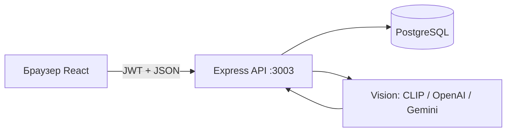

# Calorie Tracker Pro — шпаргалка для защиты диплома

## 1. Что это за проект (30 секунд)

**Веб-приложение** для учёта калорий, воды, тренировок и покупок полезных продуктов.

| Часть | Технологии | Порт |
|-------|------------|------|
| Фронтенд | React + Vite | http://localhost:5173 |
| Бэкенд | Node.js + Express | http://localhost:3003 |
| База | PostgreSQL | Docker: 5433 → контейнер `ctp-postgres` |

**Роли:** `USER` (клиент), `ADMIN` (модератор), `SUPER_ADMIN` (полный доступ + управление админами).

---

## 2. Схема работы (нарисовать на доске)



1. Пользователь нажимает кнопку во фронтенде.
2. `api/client.js` отправляет запрос на `/api/...` с токеном `Authorization: Bearer ...`.
3. Express находит **маршрут** → **middleware** (проверка JWT и роли) → **контроллер** → **SQL** в Postgres.
4. Ответ JSON → React обновляет экран.

---

## 3. Демо на защите (порядок показа)

1. **Health:** `Invoke-RestMethod http://127.0.0.1:3003/api/health` → `ok`.
2. **Вход админа** → открывается админ-панель (`/products`).
3. **Пользователь:** главная → дневник калорий → вода → AI-камера (фото еды) → магазин → корзина → заказ.
4. **Админ:** заказы (новый заказ → красный бейдж в шапке) → обращения в поддержку → ответ пользователю.
5. **Супер-админ:** `/admin-management` — создание/удаление админов.

---

## 4. Папки проекта

```
Diplomka/
├── Backend/          ← сервер, API, БД, AI
├── Front end/        ← интерфейс React
├── docs/             ← эта документация
├── docker-compose.yml
└── DOCKER.md
```

Подробные таблицы файлов:

- [Backend — назначение файлов](../Backend/docs/ФАЙЛЫ.md)
- [Frontend — назначение файлов](../Front%20end/docs/ФАЙЛЫ.md)
- [Полная структура](СТРУКТУРА.md)

---

## 5. Бэкенд — слои (что говорить комиссии)

| Слой | Папка | За что отвечает |
|------|-------|-----------------|
| Точка входа | `src/index.js` | Запуск сервера, подключение всех `/api/...` маршрутов |
| Маршруты | `src/routes/` | URL → какой контроллер вызвать |
| Контроллеры | `src/controllers/` | Бизнес-логика: валидация, SQL, ответ JSON |
| Middleware | `src/middleware/` | JWT, роли ADMIN/SUPER_ADMIN, загрузка файлов |
| БД | `config/database.js` + `database/migrations/` | Подключение Postgres, схема таблиц |
| AI-камера | `src/services/vision/` | Распознавание блюда по фото (локально или облако) |

**Пример цепочки «оформить заказ»:**  
`CartPage` → `POST /api/cart/checkout` → `checkoutController` → таблицы `orders`, `order_items`.

---

## 6. Фронтенд — слои

| Слой | Папка | За что отвечает |
|------|-------|-----------------|
| Точка входа | `main.jsx` | React + тема + язык (ru/kk/en) |
| Маршруты | `App.jsx` | Какая страница по какому URL |
| Страницы | `pages/` | Экраны: логин, профиль, магазин, админка… |
| Компоненты | `components/` | Шапка, футер, AI-чат, защита маршрутов |
| API-клиент | `api/` | Запросы на бэкенд |
| Утилиты | `utils/` | Роли, калории, бейджи админа |

**Защита маршрутов:** `ProtectedRoute` (нужен вход), `AdminRoute` (нужен ADMIN), `SuperAdminRoute` (только SUPER_ADMIN).

---

## 7. База данных — главные таблицы

| Таблица | Назначение |
|---------|------------|
| `users` | Пользователи, роль, профиль, бан |
| `food_entries` | Записи дневника питания |
| `products` | Товары магазина (админ) |
| `orders`, `order_items` | Заказы |
| `cart_items` | Корзина |
| `support_messages` | Обращения в поддержку |
| `workouts` | Тренировки |
| `scans` | История AI-распознаваний |
| `water_logs` | Учёт воды |

Миграции: `Backend/database/migrations/` — версии схемы по номерам `001_...`, `024_rbac_roles.sql`.

---

## 8. Docker — два контейнера (это нормально)

| Контейнер | Роль |
|-----------|------|
| `ctp-backend` | API |
| `ctp-postgres` | База (профиль `local-db`) |

**Важно:** в `Backend/.env` один `DATABASE_URL`. Если там Render — данные в облаке; если `@db:5432` — только локальный Postgres.

---

## 9. AI-камера (частый вопрос)

1. Фото → `POST /api/scans/recognize`.
2. `services/vision/index.js` выбирает провайдера: `auto` → Gemini → OpenAI → **локальный CLIP** (без ключей).
3. Каталог блюд: `foodCatalog.js`, ранжирование: `localRanker.js` / `LocalVisionAdapter.js`.
4. Результат сохраняется в `scans`, пользователь может добавить в дневник.

---

## 10. Красные бейджи в шапке админа

| Пункт меню | Логика |
|------------|--------|
| Заказы | `GET /api/admin/notifications/counts` — заказы с `id` больше последнего просмотренного |
| Обращения | Со статусом `new` / `in_progress`, не просмотренные |

Фронт: `Header.jsx` + `utils/adminNotifications.js` (localStorage «до какого id смотрел»).

---

## 11. Типичные вопросы на защите

**Почему React и Express?**  
Разделение: UI отдельно, API отдельно — масштабирование, мобильное приложение потом на тот же API.

**Как безопасность?**  
JWT в заголовке, пароли bcrypt, middleware `requireAdmin` / `requireSuperAdmin`, CORS.

**Где хранятся фото?**  
Папка `uploads/` в Docker volume; в БД — путь к файлу.

**Нужны ли API-ключи для камеры?**  
Нет для режима `local` / `auto` (fallback на CLIP). Ключи опциональны для Gemini/OpenAI.

**Сколько баз данных?**  
Одна PostgreSQL; в проде может быть Render, локально — Docker.

---

## 12. Команды запуска

```powershell
# Бэкенд + локальная БД
cd Backend
docker compose --profile local-db up -d --build

# Фронтенд
cd "Front end"
npm install
npm run dev
```

Проверка API: `Invoke-RestMethod http://127.0.0.1:3003/api/health`

---

## 13. Что открыть в IDE перед защитой

1. `Backend/src/index.js` — все маршруты.
2. `Backend/src/controllers/authController.js` — вход/регистрация.
3. `Front end/src/App.jsx` — все страницы.
4. `Front end/src/components/Header.jsx` — навигация и бейджи.
5. `Backend/src/services/vision/index.js` — AI.

---

## 14. Заголовки в каждом файле кода

В начале **каждого** `.js` / `.jsx`:

```javascript
/**
 * ФАЙЛ: example.js
 * ЧТО ЭТО: кратко, что это за модуль
 * ЗА ЧТО ОТВЕЧАЕТ: что делает в проекте
 */
```

Словарь текстов: `tools/file-headers.json`.  
Повторно проставить заголовки: `node tools/add-file-headers.mjs`

Удачи на защите.
